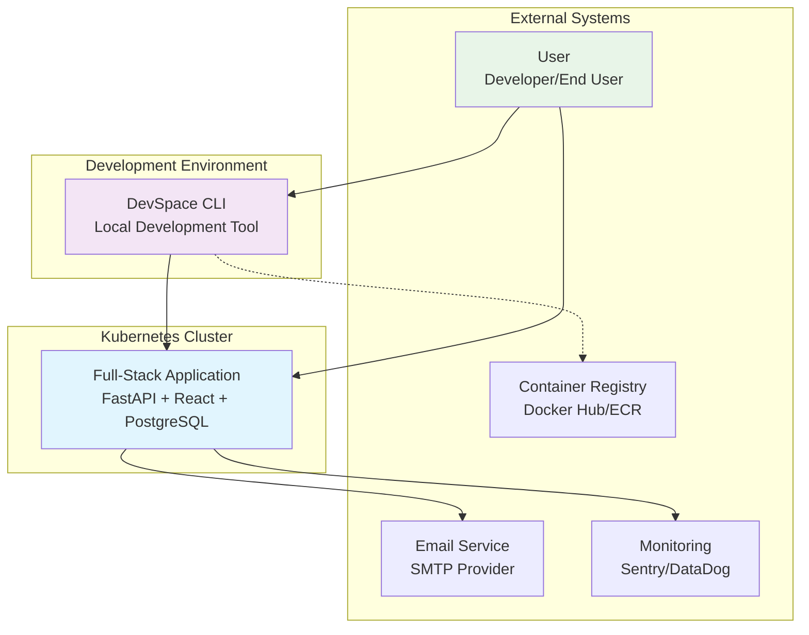
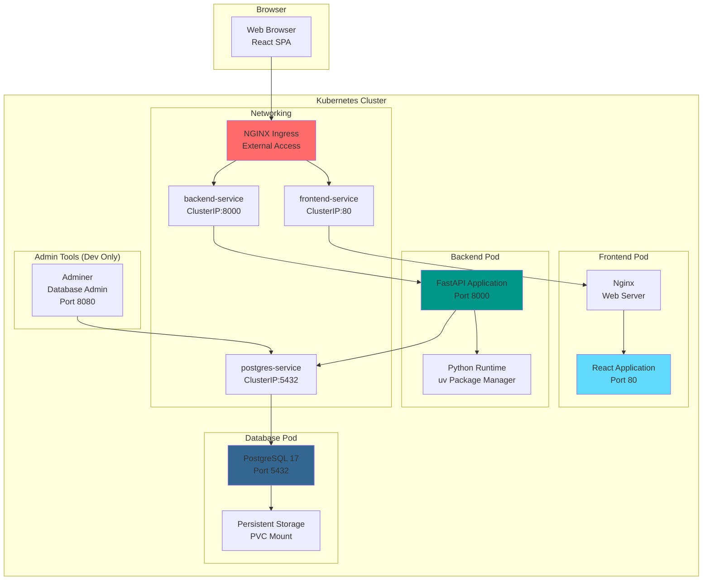
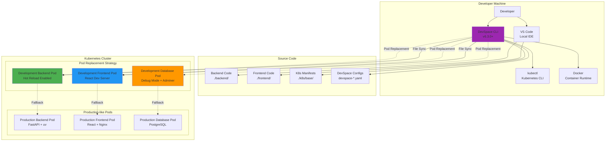
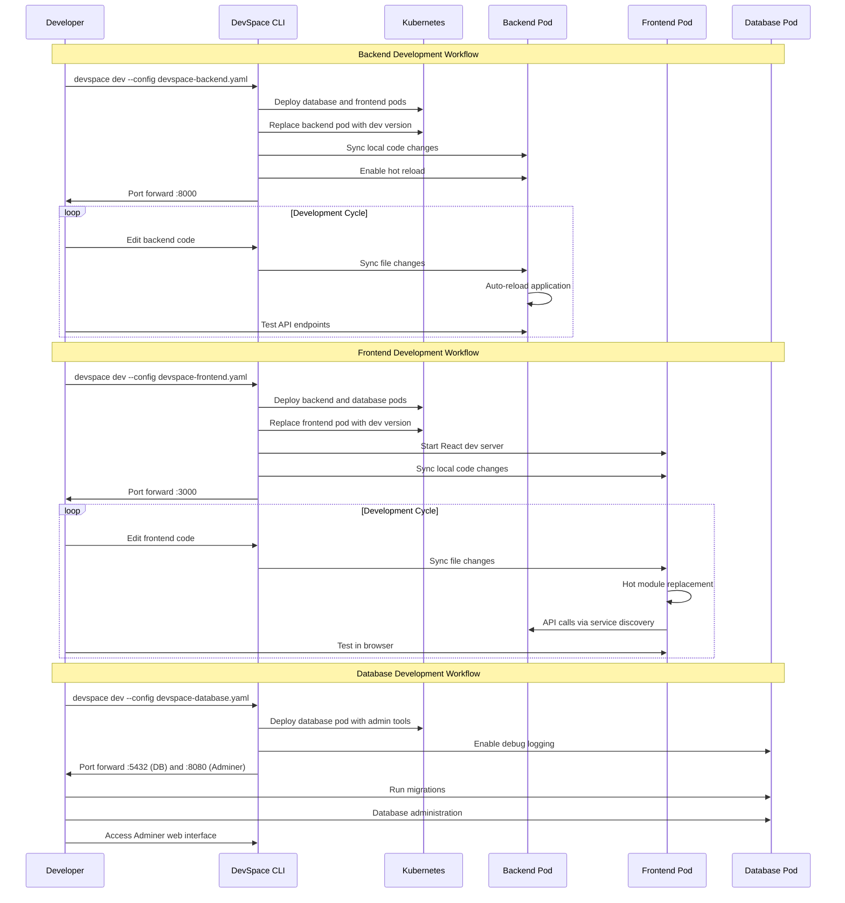
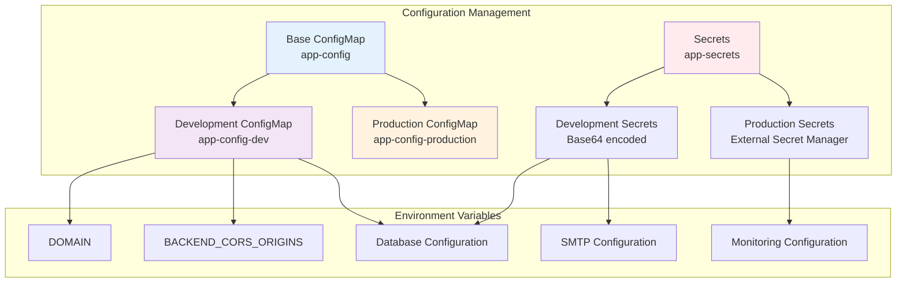
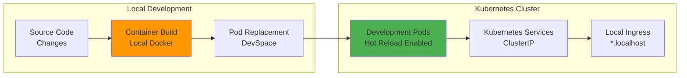
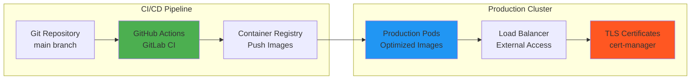
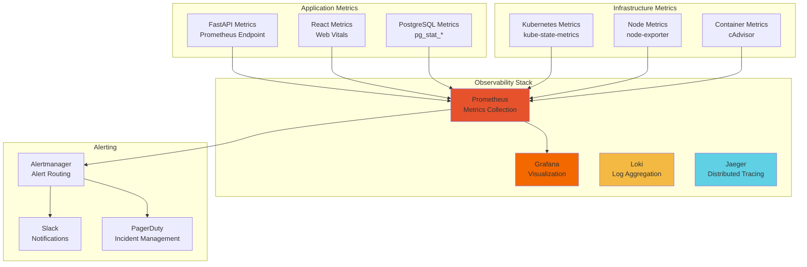

# Full-Stack DevSpace Architecture Overview

## System Context (C4 Level 1)



## Container Architecture (C4 Level 2)



## Development Workflow (C4 Level 3)



## Component Interaction Sequence



## Configuration Strategy

### ConfigMap Hierarchy


## Deployment Strategies

### Development Deployment


### Production Deployment


## Security Architecture

```mermaid
graph TB
    subgraph "Security Layers"
        subgraph "Network Security"
            INGRESS_TLS[TLS Termination<br/>Ingress Controller]
            NETWORK_POLICIES[Network Policies<br/>Pod-to-Pod Communication]
            SERVICE_MESH[Service Mesh<br/>mTLS (Optional)]
        end
        
        subgraph "Authentication & Authorization"
            JWT[JWT Tokens<br/>FastAPI Security]
            RBAC[RBAC<br/>Kubernetes]
            SERVICE_ACCOUNTS[Service Accounts<br/>Pod Identity]
        end
        
        subgraph "Secrets Management"
            K8S_SECRETS[Kubernetes Secrets<br/>Base64 Encoded]
            EXTERNAL_SECRETS[External Secrets<br/>Vault/AWS/Azure]
            SECRET_ROTATION[Secret Rotation<br/>Automated]
        end
        
        subgraph "Container Security"
            IMAGE_SCANNING[Image Scanning<br/>Trivy/Snyk]
            DISTROLESS[Distroless Images<br/>Minimal Attack Surface]
            SECURITY_CONTEXTS[Security Contexts<br/>Non-root User]
        end
    end
    
    INGRESS_TLS --> JWT
    NETWORK_POLICIES --> RBAC
    JWT --> K8S_SECRETS
    RBAC --> SERVICE_ACCOUNTS
    K8S_SECRETS --> EXTERNAL_SECRETS
    EXTERNAL_SECRETS --> SECRET_ROTATION
    
    IMAGE_SCANNING --> DISTROLESS
    DISTROLESS --> SECURITY_CONTEXTS
    
    style INGRESS_TLS fill:#4caf50
    style JWT fill:#2196f3
    style EXTERNAL_SECRETS fill:#ff9800
    style IMAGE_SCANNING fill:#9c27b0
```

## Monitoring and Observability



## Future Architecture Evolution

### Phase 1: Current State ✅
- DevSpace configurations
- Kubernetes base manifests  
- Development workflows
- Basic monitoring

### Phase 2: Production Hardening
- Helm chart conversion
- Advanced security policies
- Multi-environment support
- GitOps integration

### Phase 3: Platform Engineering
- Developer platform abstractions
- Self-service environments
- Advanced observability
- Cost optimization

### Phase 4: Cloud Native Maturity
- Service mesh integration
- Advanced deployment strategies
- AI/ML pipeline integration
- Multi-cluster operations

## Key Architectural Decisions

1. **Pod Replacement over Sidecars**: Maintains production parity
2. **Component Isolation**: Independent development workflows
3. **Kubernetes-Native**: Direct mapping to production patterns
4. **Configuration as Code**: GitOps-ready manifest structure
5. **Developer Experience**: Minimal cognitive load for common tasks

This architecture provides a solid foundation for cloud-native full-stack development while maintaining the flexibility to evolve with changing requirements and team growth.